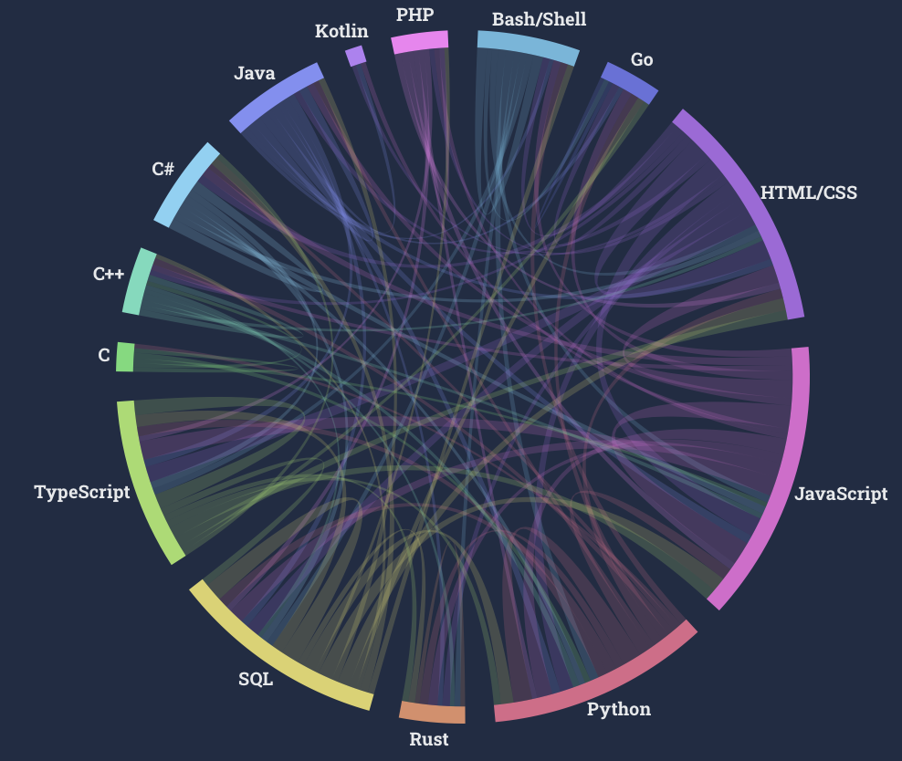

# Instruction

Read Munzner 2014 Chapter 1 and 2. Write Short Answers to Below Questions (2-3 sentences per question), and reply to at least one other person's post. Due by Sunday midnight BJT.

Q1. What factors should you consider when develop a visualization?

Q2. Choose one type of complex vis idioms from below list and find one example (attach the picture): tree maps, network, link-node, parallel coordinates, star plot, fields, geometry maps, etc.. Discuss its visualization task, interactions, and efficiency.

# Answers

## Q1

The factors to consider when developing a vis include:

1. The cognition level of the audience.
1. The computational complexity of the data and the scalability of the solution.

## Q2

An example of a network.

From [stackoverflow survey 2022](https://survey.stackoverflow.co/2022/#section-worked-with-vs-want-to-work-with-programming-scripting-and-markup-languages).

### Visualization task

Show the portion of respondents who program in one language
and want to program in another language.

### Interactions

Hovering over one language highlights the links between it
and other languages.

Clicking on one language hides its links.

### Efficiency

Through this network diagram and at a glance,
the reader can tell how big a portion of respondents program in each language
and among whom how big a portion want which language.
By looking at the ring of color by each language,
one can easily tell whether it is wanted by more respondents programming
other languages or more respondents programming in it want to program in
other languages.
Therefore, the reader can make a judgement about the future popularity
of these languages.